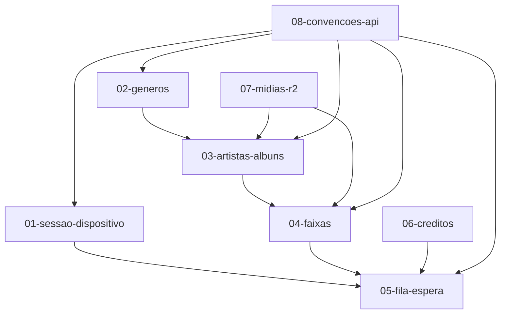

# Contrato 00 — Visão Geral

## Contexto do sistema

O JUKE-BOX é um sistema de música estilo jukebox com a seguinte arquitetura planejada:

```
┌─────────────────┐     HTTP/REST      ┌─────────────────┐
│  Frontend React │ ◄────────────────► │  Backend Django │
│  (este repo)    │                     │  (API)          │
└─────────────────┘                     └────────┬────────┘
                                                 │
                                    ┌────────────┼────────────┐
                                    ▼            ▼            ▼
                              PostgreSQL   Cloudflare R2   (futuro)
```

## Página inicial implementada no frontend

A tela principal (`src/App.jsx`) é dividida em:

| Região | Componente | Descrição |
|--------|------------|-----------|
| Topo | `Header` | Logo, status de registro, botões LEITURA/mensagens/atualizar |
| Carrossel | `GenreCarousel` | Gêneros musicais estilo disco de vinil |
| Coluna esquerda | `ArtistsGrid` | Grid de artistas/álbuns do gênero selecionado |
| Coluna central | `TrackList` | Lista de faixas do álbum selecionado |
| Coluna direita | `QueuePanel` | Fila de espera de reprodução |
| Rodapé | `StatusBar` | Créditos, mensagem de status, contagem em espera |

## Fluxo do usuário (estado atual)

```
1. Usuário vê gêneros no carrossel
2. Seleciona um gênero
3. Vê artistas/álbuns daquele gênero
4. Seleciona um artista/álbum
5. Vê lista de faixas
6. Clica em "play" em uma faixa → adiciona à fila local
7. Fila e créditos são exibidos no rodapé
```

> **Nota:** hoje os passos 1–7 usam dados mockados em `src/data/mockData.js` e a fila existe apenas no estado React (não persiste).

## Fluxo esperado com backend

```
1. GET /api/session          → status do dispositivo e créditos
2. GET /api/genres           → carrossel de gêneros
3. GET /api/genres/{id}/artists → grid de artistas
4. GET /api/albums/{id}/tracks  → lista de faixas
5. POST /api/queue           → adicionar música à fila
6. GET /api/queue            → consultar fila atual
```

## Dependências entre contratos



## O que o backend NÃO precisa fazer neste repo

- Servir arquivos estáticos do React (feito pelo Vite/Railway no frontend).
- Implementar interface visual.

## Próximos passos sugeridos para o backend

1. Definir prefixo global `/api/v1/`.
2. Implementar contratos 02, 03 e 04 (catálogo musical).
3. Implementar contrato 05 (fila) com persistência por dispositivo/sessão.
4. Implementar contratos 01 e 06 (sessão e créditos).
5. Configurar URLs de mídia via R2 (contrato 07).
