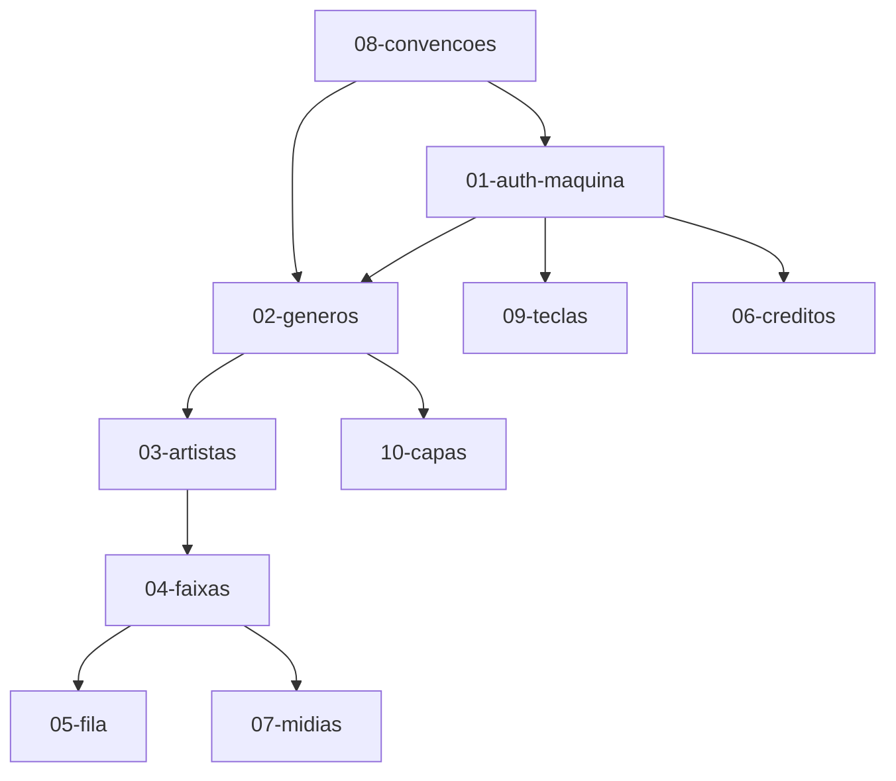

# Contrato 00 — Visão Geral

## Arquitetura

```
┌─────────────────┐     HTTP/REST      ┌─────────────────┐
│  Frontend React │ ◄────────────────► │  Backend Django │
│  (este repo)    │   Maquina <token>  │  (API v1)       │
└────────┬────────┘                    └────────┬────────┘
         │                                      │
         │  <audio src=media_url>               ├── PostgreSQL (catálogo em cache)
         └──────────────────────────────────────┤
                                                └── Cloudflare R2 (áudio, capas)
```

O player usa `media_url` **diretamente do R2**, sem proxy pelo backend.

## Cache no dispositivo

| Camada | O quê | Arquivo |
|--------|-------|---------|
| `localStorage` | Token, teclas, volume, créditos, último SUCESSO/artista, `needs_sync` | `src/lib/storage.js` |
| `sessionStorage` | Metadados da fila de espera (mesma aba) | `src/lib/storage.js` |
| IndexedDB | Catálogo JSON (gêneros, artistas, faixas — **sem áudio**) | `src/lib/idbCatalog.js` |
| Cache Storage (SW) | Capas R2 + áudio da faixa atual e das **próximas 5** da fila | `public/sw.js` |
| Pré-cache manual | Botão download no header — catálogo completo + capas R2 (**sem** áudio em lote) | `src/lib/catalogPrefetch.js` |

## Layout da tela principal

Arquivo: `src/App.jsx` → `JukeboxShell`

| Região | Componente | Descrição |
|--------|------------|-----------|
| Topo | `JukeboxHeader` | Logo, badge da máquina, Leitura, teclas, download (cache), sync |
| Banner | `PrefetchBanner` | Progresso do pré-cache offline (catálogo + capas) |
| Banner | `SyncBanner` | Aviso quando `needs_sync === true` |
| Carrossel | `GenreCarousel` | Categorias (SUCESSOS) — discos de vinil |
| Esquerda | `AlbumBrowser` | Grid de artistas/bandas do gênero |
| Centro | `SongSidePanel` | Lista de faixas do álbum selecionado |
| Direita | `WaitQueuePanel` | Fila de espera + faixa tocando |
| Extrema direita | Área reservada (`JukeboxShell`) | Espaço vazio (`--shell-right-reserve`, 18rem) para banner/anúncio futuro |
| Rodapé | `PlayerBar` | Créditos, player, progresso, fila |

## Placeholders (loading)

Enquanto a API responde, cada região exibe skeleton com shimmer (`src/components/shared/Skeleton.jsx`):

| Região | Quando | Componente |
|--------|--------|------------|
| SUCESSOS | `loading.genres` e lista vazia | `GenreCarouselSkeleton` |
| Artistas/Bandas | `loading.albums` | `AlbumGridSkeleton` |
| Faixas | `loading.tracks` | `TrackListSkeleton` |

Estados em `useLibrary.loading` (`genres` / `albums` / `tracks`); `isLoading` agrega os três para o botão sync do header.

## Fluxo do usuário (integrado)

```
1. Login → POST /maquinas/auth/ → salva token + teclas
2. GET /musicas/?prefix=Musicas/ → carrossel SUCESSOS
3. Seleciona categoria → GET /musicas/?prefix=Musicas/{Categoria}/
4. Seleciona artista → GET /musicas/?prefix=Musicas/{Categoria}/{Artista}/
5. Play em faixa → POST /maquinas/tocadas/ + debita crédito local + toca media_url
6. Tecla crédito (K) → POST /maquinas/creditos/ + toast "+1 crédito inserido"
7. Atalhos de teclado → navegação, fila, volume, pular (mapa do backend)
```

## Navegação da biblioteca

Não há endpoints separados de gêneros/artistas/faixas. Tudo é **navegação por pasta** via `GET /api/v1/musicas/?prefix=...`.

| Nível | Exemplo de `prefix` | UI |
|-------|---------------------|-----|
| Raiz | `Musicas/` | Carrossel SUCESSOS |
| Categoria | `Musicas/Pop/` | Grid Artistas/Bandas |
| Artista | `Musicas/Pop/Beatles/` | Lista de faixas |

## Dependências entre contratos



## O que o backend NÃO faz neste repo

- Servir o build React (Vite/Railway no frontend).
- Implementar UI ou atalhos de teclado (só fornece configuração).

## Pendências

- [ ] API de fila de espera (hoje local no React)
- [ ] `cover_url` pré-calculado no sync para categorias sem capa própria (contrato 10)
- [x] Botão LEITURA (faturamento) — modal + calendário; `GET /maquinas/leitura/` se o backend responder
